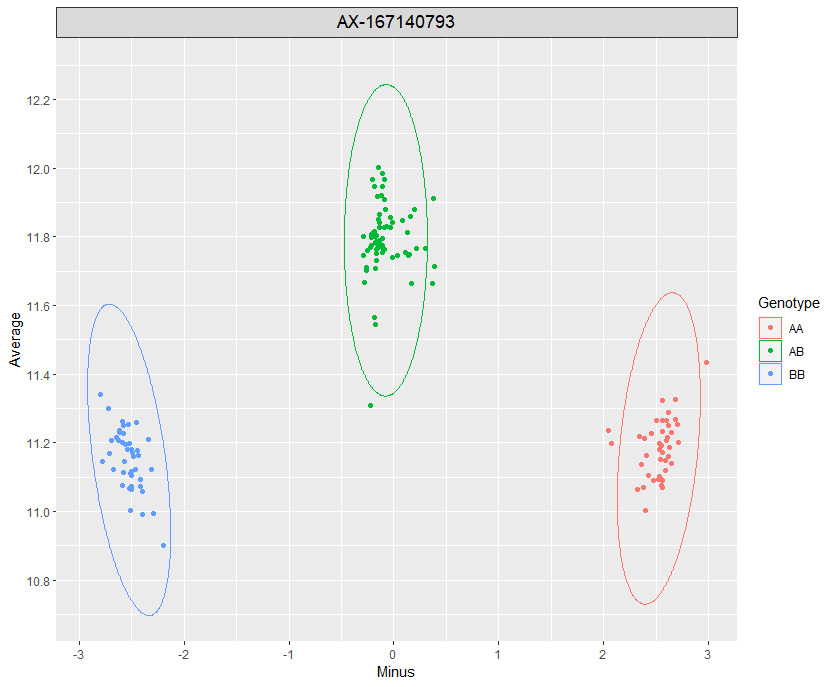
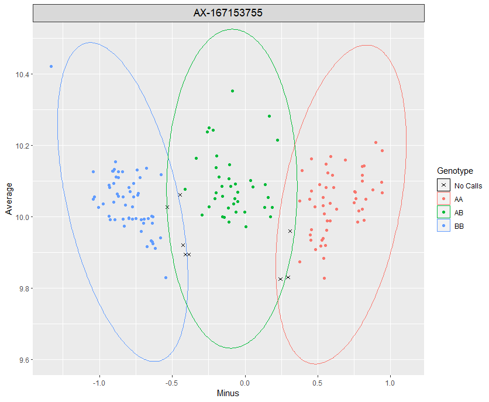
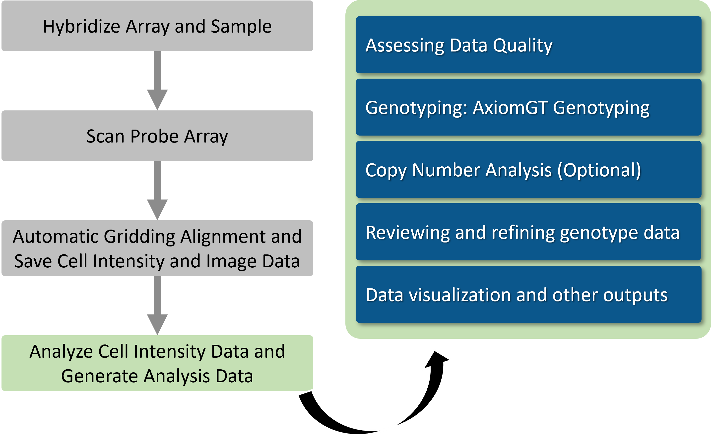
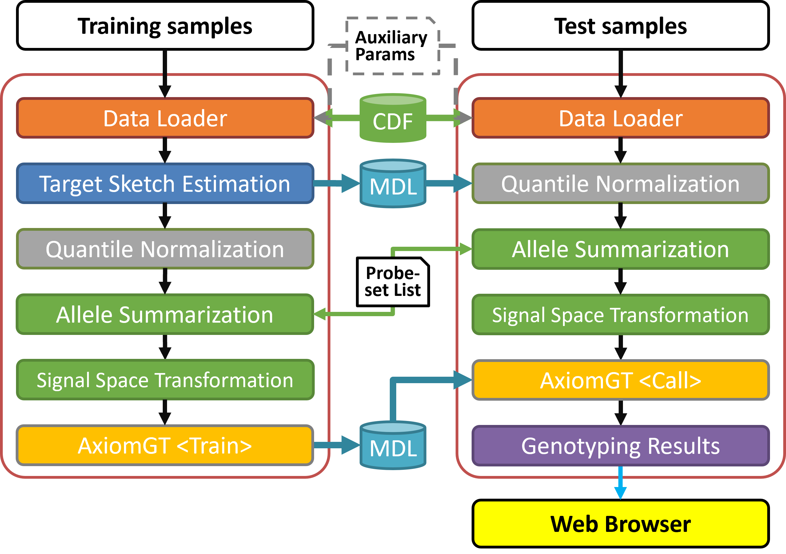

Centrillion Axiom BRLMM-P Genotyping (AxiomGT)
===

### Table of Contents
1. [**Intro**](#intro)
2. [**Workflow**](#workflow)
3. [**Quality Control**](#quality-control)
4. [**Genotyping Process**](#genotyping-process)
5. [**Data Transformation**](#data-transformation-signal-space-transformation)
    * [Minus vs. Average](#-minus-vs-average)
6. [**Special SNPs & Gender**](#special-snps-gender)
7. [**Supervised Model Training**](#supervised-model-training)
8. [**Bayesian Framework**](#bayesian-framework)
	* [Priors](#priors)
	* [Posteriors](#posteriors)
	* [Clustering Models](#clustering_models)
9. [**Training Json Example**](#training-json-example)
10. [**Calling Json Example**](#calling-json-example)
11. [**Performance Evaluation**](#performance-evaluation)

### Intro

Genotyping can be used to understand genetic diversity, study inheritance patterns, and identify associations between genetic variations and certain traits or conditions.

This document will briefly introduce the genotyping analysis procedure, AxiomGT, whose goal is to build a reliable genotyping model and predict individuals' genetic makeup from gene expression arrays manufactured in the Centrillion Technologies.

AxiomGT is an improved version of the [BRLMM-P algorithm](BRLMMp), incorporating a Bayesian framework. It employs a Normal-Inverse-Wishart (NIW) conjugate prior to blend prior and likelihood information from observations, creating a mixture of two-dimensional normal distributions (two-dimensional GMM) based on the NIW posterior for predicting the genotype of each sample and SNP. The optimization technique for identifying the optimal clustering model utilize a Quasi-Expectation-Maximization (Quasi-EM) algorithm. In the E-step, it computes the most likely mixture proportion (weights) for each genotype cluster by evaluating all plausible one-dimensional clustering scenarios. In the M-step, it updates the parameters of the two-dimensional NIW posterior using the optimal mixture proportion estimated in the E-step. The resulting two-dimensional GMM is then stored for generating genotypes of any given observations in the future by comparing probabilities within the GMM. Various parameters can influence genotyping results; for more details, please refer to the section below.

Moreover, by leveraging the Bayesian framework, users can harness the power of priors to incorporate their experimental or biological knowledge. AxiomGT offers the flexibility for users to customize priors for each SNP, enabling the integration of prior information. Users can also utilize posteriors generated from other datasets as priors in a new analysis. Additionally, AxiomGT allows analysts to input correct genotype labels, facilitating supervised learning for better clustering models and performance. Furthermore, recognizing the impact of gender on sex chromosome copy number, and the variation in copy numbers across different chromosome categories, AxiomGT can take into consideration both genders and SNP categories at the same time.

The primary output results of AxiomGT consist of two files. The first file contains genotyping results for all samples and SNPs, documenting the [MvA](#-minus-vs-average) transformed signals of the two channels, predicted genotype, corresponding posterior probability of the predicted genotype, probeset (SNP), and sample information. The second file provides the call rate of SNPs for each sample. The following figures visualize the genotyping results for selected probesets on the Banff chip. The solid ellipse represents the 95% confidence boundary of each given genotype cluster, and "No Calls" indicate that the model lacks sufficient confidence to determine the genotypes of the provided data points.

 


### Workflow

The figure below illustrates the workflow of the genetic array data analysis. AxiomGT takes gene expression data derived from the fluorescent image intensity of the chip as its input.




### Quality Control

Prior to executing AxiomGT, it is essential to filter out poor-quality gene expression array data and ensure the intensity data  accurately reflects real biological information. To achieve this, it is recommended to use various metrics, including NP call rate, Dish QC, and more, to evaluate the data quality and improve the chip design. All these metrics can be computed using [NP Call Analyzer](http://gitlab.centrilliontech.com.tw:10088/centrillion/Summit.NPCallAnalyzer). For further instructions and information, please refer to [NP Call Analyzer](http://gitlab.centrilliontech.com.tw:10088/centrillion/Summit.NPCallAnalyzer).

### Genotyping Process

The figure below illustrates the workflow of constructing models from the expression profiles and the procedure of the genotype prediction.




### Data Transformation (Signal Space Transformation)
#### * Minus vs. Average

For each data point,

Minus X = log2(A) - log2(B)

Average Y = (log2(A) + log2(B)) / 2,

where A and B represent the original intensities of two channels before transformation.

### Special SNPs & Gender
To provide gender information, users must specify the method for obtaining gender information by setting the "method" value in the JSON file. Currently supported methods include "gender_file_input" and "chrXY_ratio" only. If users choose the "gender_file_input" method, they need to specify the file path where the gender file is stored in the "auxparams_genders" value in the JSON file. Alternatively, if they opt for the "chrXY_ratio" method, they should specify the directories where the "chrXprobes" and "chrYprobes" are stored in the "auxparams_chrXprobes" and "auxparams_chrYprobes" values in the JSON file, respectively. The "Female_threshold" and "Male_threshold," used to discriminate between males and females, can also be set in the JSON file. If these threshold values are not provided, the program will use default values for downstream analysis. In case users do not provide gender information, the program will treat all samples as female. For more detailed information, please refer to the following section and JSON examples.

#### genders
 * For "gender_file_input" method in json:
```json
"sample_genders" : {
    "type" : "customize",
    "content" : {
        "method"  : "gender_file_input",
        "params": {
            "genders_file_path" : {
                "type": "ref",
                "content": "auxparams_genders"
            }
        }
    }
}
```

genders file format:
```tsv
gender	sample_files
1	Sample01.CEN
1	Sample02.CEN
0	Sample03.CEN
0	Sample04.CEN
1	Sample05.CEN
```

Meaning of the value: 0: female, 1: male

 * For "chrXY_ratio" method in json:
```json
"sample_genders" : {
    "type" : "customize",
    "content" : {
        "method"  : "chrXY_ratio",
        "params": {
            "chrXprobes_file_path" : {
                "type" : "ref",
                "content" : "auxparams_chrXprobes"
            },
            "chrYprobes_file_path" : {
                "type" : "ref",
                "content" : "auxparams_chrYprobes"
            },
            "female_threshold" :  0.54,
            "male_threshold"   :  1.0
        }
    }
}
```

chrXprobes and chrYprobes file format:
```tsv
probe_id	channel_id
288	1
871	1
2014	1
```

#### special SNPs
To address copy number issues, AxiomGT allows users to configure the copy number for specified probesets based on each gender and its category. The program will automatically integrate this gender-specific and special SNP information to guide downstream analysis. This file is not essential as input; if no special SNP information is provided, the program will automatically treat all SNPs as autosomal SNPs. For more detailed information, please refer to the following section and JSON examples.

special SNPs in json:
```json
"chip_specialSNPs": {
    "type" : "ref",
    "content" : "auxparams_specialSNPs"
}
```

specialSNPs format:
```tsv
probeset_id	chr	copy_male	copy_female
AX-11086922	X	1	2
AX-11104190	MT	1	1
AX-11106959	Y	1	0
AX-11106974	PAR	2	2
AX-12524149	X	1	2
```

Meaning of the value: Theoretical copy number for each probeset and gender.

* Explanation of the code in the chr column:

| code | chr region                                       |
|------|--------------------------------------------------|
| X    | The non-pseudoautosomal region of the X chromosome |
| Y    | The Y chromosome                                |
| MT   | Mitochondrial SNPs                             |
| PAR  | The pseudoautosomal region of the X chromosome  |

### Supervised Model Training
AxiomGT can assist users in constructing improved clustering models by incorporating known genotypes (genotype hints). This feature is supported by the file stored in the file path which is specified in the value of "auxparams_genotype_hints". This file is not essential as input; if no genotype information is provided, the program will automatically adopt the default model construction process. For more details, please refer to the following section and JSON examples.

#### genotype hints
To provide genotype hint information, users need to supply the genotype labels table and the names of each probeset (each row) and sample (each column).

genotype hints in json:
```json
"sample_genotype_hints" : {
    "type" : "ref",
    "content" : "auxparams_genotype_hints"
}
```

genotype_hints format (*.xml):
```xml
<?xml version="1.0" encoding="UTF-8" standalone="yes" ?>
<!DOCTYPE boost_serialization>
<boost_serialization signature="serialization::archive" version="15">
<Genohints_table>
	2	-1	0	1	1
	2	2	1	1	2
	0	0	1	1	1
</Genohints_table>
<Probeset_names_for_row class_id="0" tracking_level="0" version="0">
	<count>3</count>
	<item_version>0</item_version>
        <item>AFFX-SNP-000001</item>
        <item>AFFX-SNP-000002</item>
        <item>AFFX-SNP-000003</item>
</Probeset_names>
<Sample_names_for_col>
	<count>5</count>
	<item_version>0</item_version>
        <item>GSM2066668_206-001_CHB</item>
        <item>GSM2066669_206-003_CHB</item>
        <item>GSM2066670_206-004_CHB</item>
        <item>GSM2066671_206-014_CHB</item>
        <item>GSM2066672_206-015_CHB</item>
</Sample_names>
</boost_serialization>
```

Meaning of the value: genotype cluster label: -1 :: No Calls, 0 :: AA, 1 :: AB, 2 :: BB

### Bayesian Framework
AxiomGT utilizes a Bayesian model to integrate information from priors and observations, employing the Normal-Inverse-Wishart distribution as the conjugate prior. After updating information from observations, it generates and outputs Normal-Inverse-Wishart posteriors and constructs clustering models based on these posteriors. To enhance flexibility in building the Bayesian model, the file format for priors and posteriors is the same, allowing users to directly use current posteriors as priors input for new analysis procedures. Additionally, AxiomGT provides users with various ways to customize their priors. Priors file is not essential as input; if no priors information is provided, the program will automatically use (inner) default generic priors for the downstream model-building process. For more details, please refer to the following section and JSON examples.

#### Priors
If users want to customize their prior models, the input file path for the priors need to be specified in the value of "axiomGT_probeset_priors" in the JSON file. Furthermore, AxiomGT offers users three ways to setup their prior models. The program will automatically detect the method that users used to customize their prior models and build models for the downstream analysis.

priors in json:
```json
"probeset_priors" : {
    "type" : "ref",
    "content" : "axiomGT_probeset_priors"
}
```

priors format (*.xml):
##### 1. Customize the generic prior and use it for automatically building the prior for every probeset.
```xml
<?xml version="1.0" encoding="UTF-8" standalone="yes" ?>
<!DOCTYPE boost_serialization>
<boost_serialization signature="serialization::archive" version="15">
<NIW_models class_id="0" tracking_level="0" version="0">
	<count>1</count>
	<item_version>0</item_version>
	<item class_id="1" tracking_level="0" version="0">
		<ProbesetInfoCounts>2</ProbesetInfoCounts>
		<Info class_id="2" tracking_level="0" version="0">
			<Copynumber>1</Copynumber>
			<ModelInfo class_id="3" tracking_level="0" version="0">
				<ProbesetName>GENERIC</ProbesetName>
				<distBB class_id="4" tracking_level="0" version="0">
					<mean0>
						<count>2</count>
						<item_version>0</item_version>
						<item>-2.0</item>
						<item>10.5</item>
					</mean0>
					<k0>0.2</k0>
					<covariance0>
						<count>4</count>
						<item_version>0</item_version>
						<item>0.06</item>
						<item>0.0</item>
						<item>0.0</item>
						<item>0.3</item>
					</covariance0>
					<v0>1.0</v0>
				</distBB>
				<distAB>
					<mean0>
						<count>2</count>
						<item_version>0</item_version>
						<item>0.0</item>
						<item>11.0</item>
					</mean0>
					<k0>0.3</k0>
					<covariance0>
						<count>4</count>
						<item_version>0</item_version>
						<item>0.06</item>
						<item>0.0</item>
						<item>0.0</item>
						<item>0.3</item>
					</covariance0>
					<v0>10.0</v0>
				</distAB>
				<distAA>
					<mean0>
						<count>2</count>
						<item_version>0</item_version>
						<item>2.0</item>
						<item>10.5</item>
					</mean0>
					<k0>0.2</k0>
					<covariance0>
						<count>4</count>
						<item_version>0</item_version>
						<item>0.06</item>
						<item>0.0</item>
						<item>0.0</item>
						<item>0.3</item>
					</covariance0>
					<v0>1.0</v0>
				</distAA>
				<btwclusterscovariance0>
					<count>12</count>
					<item_version>0</item_version>
					<item>-0.1</item>
					<item>-0.1</item>
					<item>-0.1</item>
					<item>-0.05</item>
					<item>-0.1</item>
					<item>-0.05</item>
					<item>0.0</item>
					<item>0.0</item>
					<item>0.0</item>
					<item>0.0</item>
					<item>0.0</item>
					<item>0.0</item>
				</btwclusterscovariance0>
			</ModelInfo>
		</Info>
		<Info>
			<Copynumber>2</Copynumber>
			<ModelInfo>
				<ProbesetName>GENERIC</ProbesetName>
				<distBB>
					<mean0>
						<count>2</count>
						<item_version>0</item_version>
						<item>-2.0</item>
						<item>10.5</item>
					</mean0>
					<k0>0.2</k0>
					<covariance0>
						<count>4</count>
						<item_version>0</item_version>
						<item>0.06</item>
						<item>0.0</item>
						<item>0.0</item>
						<item>0.3</item>
					</covariance0>
					<v0>1.0</v0>
				</distBB>
				<distAB>
					<mean0>
						<count>2</count>
						<item_version>0</item_version>
						<item>0.0</item>
						<item>11.0</item>
					</mean0>
					<k0>0.3</k0>
					<covariance0>
						<count>4</count>
						<item_version>0</item_version>
						<item>0.06</item>
						<item>0.0</item>
						<item>0.0</item>
						<item>0.3</item>
					</covariance0>
					<v0>10.0</v0>
				</distAB>
				<distAA>
					<mean0>
						<count>2</count>
						<item_version>0</item_version>
						<item>2.0</item>
						<item>10.5</item>
					</mean0>
					<k0>0.2</k0>
					<covariance0>
						<count>4</count>
						<item_version>0</item_version>
						<item>0.06</item>
						<item>0.0</item>
						<item>0.0</item>
						<item>0.3</item>
					</covariance0>
					<v0>1.0</v0>
				</distAA>
				<btwclusterscovariance0>
					<count>12</count>
					<item_version>0</item_version>
					<item>-0.1</item>
					<item>-0.1</item>
					<item>-0.1</item>
					<item>-0.05</item>
					<item>-0.1</item>
					<item>-0.05</item>
					<item>0.0</item>
					<item>0.0</item>
					<item>0.0</item>
					<item>0.0</item>
					<item>0.0</item>
					<item>0.0</item>
				</btwclusterscovariance0>
			</ModelInfo>
		</Info>
	</item>
</NIW_models>
</boost_serialization>
```

EXPLANATION: The above prior file includes only the "GENERIC" prior, comprising two NIW models, one for copy number 1, and the other for copy number 2. AxiomGT will automatically generate the prior for every probeset based on the provided generic prior and the corresponding copy number. If users configure different NIW model settings for the two copy numbers, the prior model for the probeset with the corrsponding copy number will also vary accrodingly.

##### 2. Customize the generic prior, set up the prior for some specific probesets and use the generic prior for automatically building the prior for the remaining probesets.
```xml
<?xml version="1.0" encoding="UTF-8" standalone="yes" ?>
<!DOCTYPE boost_serialization>
<boost_serialization signature="serialization::archive" version="15">
<NIW_models class_id="0" tracking_level="0" version="0">
	<count>4</count>
	<item_version>0</item_version>
	<item class_id="1" tracking_level="0" version="0">
		<ProbesetInfoCounts>2</ProbesetInfoCounts>
		<Info class_id="2" tracking_level="0" version="0">
			<Copynumber>1</Copynumber>
			<ModelInfo class_id="3" tracking_level="0" version="0">
				<ProbesetName>GENERIC</ProbesetName>
					... NIW model info ...
			</ModelInfo>
		</Info>
		<Info>
			<Copynumber>2</Copynumber>
			<ModelInfo>
				<ProbesetName>GENERIC</ProbesetName>
					... NIW model info ... 
			</ModelInfo>
		</Info>
	</item>
	<item>
		<ProbesetInfoCounts>1</ProbesetInfoCounts>
		<Info>
			<Copynumber>2</Copynumber>
			<ModelInfo>
				<ProbesetName>AFFX-SNP-000001</ProbesetName>
				<distBB>
					<mean0>
						<count>2</count>
						<item_version>0</item_version>
						<item>-7.0</item>
						<item>9.0</item>
					</mean0>
					<k0>2.0</k0>
					<covariance0>
						<count>4</count>
						<item_version>0</item_version>
						<item>6.0</item>
						<item>1.0</item>
						<item>1.0</item>
						<item>2.0</item>
					</covariance0>
					<v0>2.0</v0>
				</distBB>
				<distAB>
					<mean0>
						<count>2</count>
						<item_version>0</item_version>
						<item>0.0</item>
						<item>10.0</item>
					</mean0>
					<k0>2.0</k0>
					<covariance0>
						<count>4</count>
						<item_version>0</item_version>
						<item>6.0</item>
						<item>2.0</item>
						<item>2.0</item>
						<item>3.0</item>
					</covariance0>
					<v0>2.0</v0>
				</distAB>
				<distAA>
					<mean0>
						<count>2</count>
						<item_version>0</item_version>
						<item>7.0</item>
						<item>9.0</item>
					</mean0>
					<k0>3.0</k0>
					<covariance0>
						<count>4</count>
						<item_version>0</item_version>
						<item>6.0</item>
						<item>-2.0</item>
						<item>-2.0</item>
						<item>3.0</item>
					</covariance0>
					<v0>30</v0>
				</distAA>
				<btwclusterscovariance0>
					<count>12</count>
					<item_version>0</item_version>
					<item>-1.0</item>
					<item>-1.0</item>
					<item>-1.0</item>
					<item>-5.0</item>
					<item>-1.0</item>
					<item>-5.0</item>
					<item>0.0</item>
					<item>0.0</item>
					<item>0.0</item>
					<item>0.0</item>
					<item>0.0</item>
					<item>0.0</item>
				</btwclusterscovariance0>
			</ModelInfo>
		</Info>
	</item>
	<item>
		<ProbesetInfoCounts>1</ProbesetInfoCounts>
		<Info>
			<Copynumber>1</Copynumber>
			<ModelInfo>
				<ProbesetName>AFFX-SNP-000002</ProbesetName>
				<distBB>
					<mean0>
						<count>2</count>
						<item_version>0</item_version>
						<item>-7.0</item>
						<item>9.0</item>
					</mean0>
					<k0>2.0</k0>
					<covariance0>
						<count>4</count>
						<item_version>0</item_version>
						<item>6.0</item>
						<item>1.0</item>
						<item>1.0</item>
						<item>2.0</item>
					</covariance0>
					<v0>2.0</v0>
				</distBB>
				<distAB>
					<mean0>
						<count>2</count>
						<item_version>0</item_version>
						<item>0.0</item>
						<item>10.0</item>
					</mean0>
					<k0>2.0</k0>
					<covariance0>
						<count>4</count>
						<item_version>0</item_version>
						<item>6.0</item>
						<item>2.0</item>
						<item>2.0</item>
						<item>3.0</item>
					</covariance0>
					<v0>2.0</v0>
				</distAB>
				<distAA>
					<mean0>
						<count>2</count>
						<item_version>0</item_version>
						<item>7.0</item>
						<item>9.0</item>
					</mean0>
					<k0>3.0</k0>
					<covariance0>
						<count>4</count>
						<item_version>0</item_version>
						<item>6.0</item>
						<item>-2.0</item>
						<item>-2.0</item>
						<item>3.0</item>
					</covariance0>
					<v0>30</v0>
				</distAA>
				<btwclusterscovariance0>
					<count>12</count>
					<item_version>0</item_version>
					<item>-1.0</item>
					<item>-1.0</item>
					<item>-1.0</item>
					<item>-5.0</item>
					<item>-1.0</item>
					<item>-5.0</item>
					<item>0.0</item>
					<item>0.0</item>
					<item>0.0</item>
					<item>0.0</item>
					<item>0.0</item>
					<item>0.0</item>
				</btwclusterscovariance0>
			</ModelInfo>
		</Info>
	</item>
	<item>
		<ProbesetInfoCounts>2</ProbesetInfoCounts>
		<Info>
			<Copynumber>2</Copynumber>
			<ModelInfo>
				<ProbesetName>AFFX-SNP-000003</ProbesetName>
				<distBB>
					<mean0>
						<count>2</count>
						<item_version>0</item_version>
						<item>-3</item>
						<item>4</item>
					</mean0>
					<k0>2.0</k0>
					<covariance0>
						<count>4</count>
						<item_version>0</item_version>
						<item>6.0</item>
						<item>1.0</item>
						<item>1.0</item>
						<item>2.0</item>
					</covariance0>
					<v0>2.0</v0>
				</distBB>
				<distAB>
					<mean0>
						<count>2</count>
						<item_version>0</item_version>
						<item>0</item>
						<item>5</item>
					</mean0>
					<k0>2.0</k0>
					<covariance0>
						<count>4</count>
						<item_version>0</item_version>
						<item>6.0</item>
						<item>2.0</item>
						<item>2.0</item>
						<item>3.0</item>
					</covariance0>
					<v0>2.0</v0>
				</distAB>
				<distAA>
					<mean0>
						<count>2</count>
						<item_version>0</item_version>
						<item>3</item>
						<item>4</item>
					</mean0>
					<k0>3.0</k0>
					<covariance0>
						<count>4</count>
						<item_version>0</item_version>
						<item>6.0</item>
						<item>-2.0</item>
						<item>-2.0</item>
						<item>3.0</item>
					</covariance0>
					<v0>30</v0>
				</distAA>
				<btwclusterscovariance0>
					<count>12</count>
					<item_version>0</item_version>
					<item>-1.0</item>
					<item>-1.0</item>
					<item>-1.0</item>
					<item>-5.0</item>
					<item>-1.0</item>
					<item>-5.0</item>
					<item>0.0</item>
					<item>0.0</item>
					<item>0.0</item>
					<item>0.0</item>
					<item>0.0</item>
					<item>0.0</item>
				</btwclusterscovariance0>
			</ModelInfo>
		</Info>
		<Info>
			<Copynumber>1</Copynumber>
			<ModelInfo>
				<ProbesetName>AFFX-SNP-000003</ProbesetName>
				<distBB>
					<mean0>
						<count>2</count>
						<item_version>0</item_version>
						<item>-7.0</item>
						<item>9.0</item>
					</mean0>
					<k0>2.0</k0>
					<covariance0>
						<count>4</count>
						<item_version>0</item_version>
						<item>6.0</item>
						<item>1.0</item>
						<item>1.0</item>
						<item>2.0</item>
					</covariance0>
					<v0>2.0</v0>
				</distBB>
				<distAB>
					<mean0>
						<count>2</count>
						<item_version>0</item_version>
						<item>0.0</item>
						<item>10.0</item>
					</mean0>
					<k0>2.0</k0>
					<covariance0>
						<count>4</count>
						<item_version>0</item_version>
						<item>6.0</item>
						<item>2.0</item>
						<item>2.0</item>
						<item>3.0</item>
					</covariance0>
					<v0>2.0</v0>
				</distAB>
				<distAA>
					<mean0>
						<count>2</count>
						<item_version>0</item_version>
						<item>7.0</item>
						<item>9.0</item>
					</mean0>
					<k0>3.0</k0>
					<covariance0>
						<count>4</count>
						<item_version>0</item_version>
						<item>6.0</item>
						<item>-2.0</item>
						<item>-2.0</item>
						<item>3.0</item>
					</covariance0>
					<v0>30</v0>
				</distAA>
				<btwclusterscovariance0>
					<count>12</count>
					<item_version>0</item_version>
					<item>-1.0</item>
					<item>-1.0</item>
					<item>-1.0</item>
					<item>-5.0</item>
					<item>-1.0</item>
					<item>-5.0</item>
					<item>0.0</item>
					<item>0.0</item>
					<item>0.0</item>
					<item>0.0</item>
					<item>0.0</item>
					<item>0.0</item>
				</btwclusterscovariance0>
			</ModelInfo>
		</Info>
	</item>
</NIW_models>
</boost_serialization>
```

EXPLANATION: The above priors file includes four priors. The first one is the "GENERIC" prior, the second is for the "AFFX-SNP-000001" probeset, the third is for "AFFX-SNP-000002", and the fourth is for "AFFX-SNP-000003". Each prior has a different copy number setting. AxiomGT will automatically generate the prior for the remaining unspecified probeset models based on the provided "GENERIC" prior and the corresponding copy number. 

For instance, in the above given prior, the "AFFX-SNP-000001" probeset only has a NIW model set for copy number 2. However, if the "AFFX-SNP-000001" probeset theoretically has both copy number 1 and 2 (listed in the specialSNPs file with different copy number settings for the two genders), AxiomGT will automatically take the model with copy number 1 under the "GENERIC" prior as that under the "AFFX-SNP-000001" probeset. The user-provided NIW model then serves as the prior model with copy number 2 for the "AFFX-SNP-000001" probeset. 

If users configure different NIW model settings for the two copy numbers under the "GENERIC" prior, the prior model for the probeset with the corrsponding copy number will also vary accrodingly. The "... NIW model info ..." in the above example is just an abbreviation for the entire NIW model, similar to the settings in [1](#1-customize-the-generic-prior-and-use-it-for-automatically-building-the-prior-for-every-probeset).

##### 3. Customize the generic prior and set up the prior for every probeset artificially.
```xml
<?xml version="1.0" encoding="UTF-8" standalone="yes" ?>
<!DOCTYPE boost_serialization>
<boost_serialization signature="serialization::archive" version="15">
<NIW_models class_id="0" tracking_level="0" version="0">
	<count>663249</count>
	<item_version>0</item_version>
	<item class_id="1" tracking_level="0" version="0">
		<ProbesetInfoCounts>2</ProbesetInfoCounts>
		<Info class_id="2" tracking_level="0" version="0">
			<Copynumber>1</Copynumber>
			<ModelInfo class_id="3" tracking_level="0" version="0">
				<ProbesetName>GENERIC</ProbesetName>
					... NIW model info ...
			</ModelInfo>
		</Info>
		<Info>
			<Copynumber>2</Copynumber>
			<ModelInfo>
				<ProbesetName>GENERIC</ProbesetName>
					... NIW model info ...
			</ModelInfo>
		</Info>
	</item>
	<item>
		<ProbesetInfoCounts>1</ProbesetInfoCounts>
		<Info>
			<Copynumber>2</Copynumber>
			<ModelInfo>
				<ProbesetName>AFFX-SNP-000001</ProbesetName>
					... NIW model info ...
			</ModelInfo>
		</Info>
	</item>
	<item>
		<ProbesetInfoCounts>1</ProbesetInfoCounts>
		<Info>
			<Copynumber>2</Copynumber>
			<ModelInfo>
				<ProbesetName>AFFX-SNP-000002</ProbesetName>
					... NIW model info ...
			</ModelInfo>
		</Info>
		<Info>
			<Copynumber>1</Copynumber>
			<ModelInfo>
				<ProbesetName>AFFX-SNP-000002</ProbesetName>
					... NIW model info ...
			</ModelInfo>
		</Info>
	</item>
	<item>
		<ProbesetInfoCounts>2</ProbesetInfoCounts>
		<Info>
			<Copynumber>1</Copynumber>
			<ModelInfo>
				<ProbesetName>AFFX-SNP-000003</ProbesetName>
					... NIW model info ...
			</ModelInfo>
		</Info>
		<Info>
			<Copynumber>2</Copynumber>
			<ModelInfo>
				<ProbesetName>AFFX-SNP-000003</ProbesetName>
					... NIW model info ...
			</ModelInfo>
		</Info>
	</item>
		.
        .
        .
        663245 items in total.
        .
        .
        .
</NIW_models>
</boost_serialization>
```

EXPLANATION: The above priors file comprises 663249 priors. The first one is the "GENERIC" prior, while the remaining 663248 prior items are provided for the prior model of the corresponding copy number under specified probeset.

The "... NIW model info ..." in the above example is just an abbreviation for the entire NIW model, similar to the settings in [1](#1-customize-the-generic-prior-and-use-it-for-automatically-building-the-prior-for-every-probeset).

NOTICE: 
 * Regardless of the setup strategy employed, the first item in the priors must be set for the "GENERIC" prior.
 * AxiomGT currently supports only 0, 1, and 2 copy number settings.
 * AxiomGT will use the provided <ProbesetName> to identify and set the prior model for the corresponding probeset.

#### Posteriors
The AxiomGT program will automatically generate the posteriors once the "is_posterior" flag is set to true and when the program successfully integrates information from priors and data. The output path for the posteriors is specified in the value of "axiomGT_probeset_posteriors" in the JOSN file.

posteriors in json:
```json
"is_posterior": {
    "type" : "literal",
    "content": true
},
"probeset_posteriors" : {
    "type" : "ref",
    "content" : "axiomGT_probeset_posteriors"
}
```

The format of posteriors (*.xml) is the same as [that of priors](#3-customize-the-generic-prior-and-set-up-the-prior-for-every-probeset-artificially).

NOTICE: Due to the repeated use of this file, the first item in the posteriors will be automatically set to the "GENERIC" prior.

#### Clustering_models
The AxiomGT program automatically generates clustering models (GMMs) after successfully integrating information from priors and data. This file holds significance as it can be utilized to predict the genotype of a new observation. Alongside clustering models, other parameters (callOcean, callMaxConfidence) employed in predicting genotypes are also stored in this file. The output path for the clustering models is specified in the value of "clustering_models" in the JSON file. For more details, please refer to the following section and JSON examples.

clustering model in json:
```json
"clustering_models" : [
    "ModelFile.mdl"
]
```

clustering model format (*.xml):
```xml
<?xml version="1.0" encoding="UTF-8" standalone="yes" ?>
<!DOCTYPE boost_serialization>
<boost_serialization signature="serialization::archive" version="15">
<AxiomGTModels class_id="0" tracking_level="0" version="0">
	<count>663248</count>
	<item_version>0</item_version>
	<item class_id="1" tracking_level="0" version="0">
		<ProbesetInfoCounts>1</ProbesetInfoCounts>
		<Info class_id="2" tracking_level="0" version="0">
			<Copynumber>2</Copynumber>
			<ModelInfo class_id="3" tracking_level="0" version="0">
				<ProbesetName>AFFX-SNP-000001</ProbesetName>
				<Model class_id="4" tracking_level="0" version="0">
					... GMM model info ...
				</Model>
				<Validate>1</Validate>
			</ModelInfo>
		</Info>
	</item>
	<item>
		<ProbesetInfoCounts>1</ProbesetInfoCounts>
		<Info>
			<Copynumber>2</Copynumber>
			<ModelInfo>
				<ProbesetName>AFFX-SNP-000002</ProbesetName>
				<Model>
					... GMM model info ...
				</Model>
				<Validate>1</Validate>
			</ModelInfo>
		</Info>
	</item>
	<item>
		<ProbesetInfoCounts>1</ProbesetInfoCounts>
		<Info>
			<Copynumber>2</Copynumber>
			<ModelInfo>
				<ProbesetName>AFFX-SNP-000003</ProbesetName>
				<Model>
					... GMM model info ...
				</Model>
				<Validate>1</Validate>
			</ModelInfo>
		</Info>
	</item>
        .
        .
        .
        663245 items in total.
        .
        .
        .
</AxiomGTModels>
<callOcean>1.00000000000000008e-05</callOcean>
<callMaxConfidence>1.49999999999999994e-01</callMaxConfidence>
</boost_serialization>
```

Meaning of the value:The "Validate" parameter indicates whether the model can be used to predict the genotype of a new observation. When its value is 1, it signifies that the GMM model for that probeset is valid and can be utilized in the calling process. Otherwise, if the corresponding model is invalid, the genotype of a new observation will automatically be set to "No Calls, -1".

### Training Json Example
```json
    {
        "context" : {                                                   # Pipeline contexts config
            "output_dir" :                                              # The output path or prefix
                "OutputPath/Prefix_"
            ,
            "chip_layout" :                                             # The input file for CAD / CDF
                "ChipFile.CAD"
            ,
            "clustering_models" : [                                     # The output path of model files 
                "ModelFile.MDL"
            ],
            "auxparams_genders":                                        # The input path of genders file (optional)
                "genders"
            ,
            "auxparams_chrXprobes":                                     # The input path of chrX probes file (optional)
                "chrXprobes"
            ,
            "auxparams_chrYprobes":                                     # The input path of chrY probes file (optional)
                "chrYprobes"
            ,
            "auxparams_specialSNPs":                                    # The input path of specialSNPs file (optional)
                "specialSNPs"
            ,
            "auxparams_genotype_hints":                                 # The input path of genotype hints file (optional)
                "Genohints.XML"
            ,
            "quantile_norm_target_sketch" :                             # The sketch file for quantile normalization
                "TargetSketch.TXT"
            ,
            "axiomGT_probeset_priors":                                  # The input path of prior model of each probeset
                "priors.MDL"
            ,
            "axiomGT_probeset_posteriors":                              # The output path of posterior model of each probeset
                "posteriors.MDL"
            ,
            "probeset_list" :                                           # The probeset list file for allele summarization
                "ProbeSetList.PS"
            ,
            "sample_files" : [                                          # The input path of CEN / CEL files
                "Sample01.CEN"
              , "Sample02.CEN"
              , "Sample03.CEN"
              , "Sample04.CEN"
              , "Sample05.CEN"
            ]
        },
        "pipeline" : [                                                  # Pipeline components config
            {
                "name" : "Input:DataLoader",                            # Component DataLoader is used to load CEL, CEN, CDF, CAD files
                "parameter" : {
                    "thread_num" : {                                    # Parameters for the thread usage in the multithreading processing.
                        "type" : "literal",
                        "content" : 10
                    }
                }
            }
          , {
                "name" : "Input:AuxiliaryParamsLoader",                 # Component AuxiliaryParamsLoader is used to load sample genders, special SNPs, and genotype hint if the analysis needs those covariates to be considered.
                "parameter" : {
                    "sample_genders" : {                                # Sample genders information, default: all samples are considered female.
                        "type" : "customize",
                        "content" : {
                            "method"  : "chrXY_ratio",                  # Method used to provide genders information. Currently, the system only supports direct file input for the gender file or estimates gender from the chrX and chrY ratio. 
                            "params": {
                                "chrXprobes_file_path" : {              # The input chrXprobes file path.
                                    "type" : "ref",
                                    "content" : "auxparams_chrXprobes"
                                },
                                "chrYprobes_file_path" : {              # The input chrYprobes file path.
                                    "type" : "ref",
                                    "content" : "auxparams_chrYprobes"
                                },
                                "female_threshold" :  0.54,             # The threshold used to specify female from the chrX and chrY ratio. Default value is 0.54.
                                "male_threshold"   :  1.0               # The threshold used to specify male from the chrX and chrY ratio. Default value is 1.0.
                            }
                        }
                    },
                    "chip_specialSNPs": {                               # The input special SNPs file path.
                        "type" : "ref",
                        "content" : "auxparams_specialSNPs"
                    },
                    "sample_genotype_hints": {                          # The input sample genotype hints file path.
                        "type" : "ref",
                        "content" : "auxparams_genotype_hints"
                    },
                    "thread_num" : {                                    # Parameters for the thread usage in the multithreading processing.
                        "type" : "literal",
                        "content" : 10
                    }
                }
                }
            }
          , {
                "name" : "Train:TargetSketchEstimation",                # Component TargetSketchEstimation is used to estimate sketch for quantile normalization
                "parameter" : {
                    "target_sketch" : {                                 # The output sketch file path
                        "type" : "ref",
                        "content" : "quantile_norm_target_sketch" 
                    },
                    "scaling_factor" : {                                # The sketch scaling factor, 0 = all, default = 50000
                        "type" : "literal",
                        "content" : 0
                    },
                    "thread_num" : {                                    # Parameters for the thread usage in the multithreading processing.
                        "type" : "literal",
                        "content" : 10
                    }
                }
            }
          , {
                "name" : "Transform:QuantileNormalization",             # Component QuantileNormalization is used to do quantile normalization with sketch file
                "parameter" : {
                    "target_sketch" : {                                 # The input sketch file path
                        "type" : "ref",
                        "content" : "quantile_norm_target_sketch"
                    },
                    "scaling_factor" : {                                # The sketch scaling factor, must be the same with sketch file
                        "type" : "literal",
                        "content" : 0
                    },
                    "thread_num" : {                                    # Parameters for the thread usage in the multithreading processing.
                        "type" : "literal",
                        "content" : 10
                    }
                }
            }
          , {
                "name" : "Transform:AlleleSummarization",               # Component AlleleSummarization is used to summarize probes with CAD / CDF file and filter by probeset list file
                "parameter" : {
                    "probeset_list" : {                                 # The input probeset list file path
                        "type" : "ref",
                        "content" : "probeset_list"
                    },
                    "thread_num" : {                                    # Parameters for the thread usage in the multithreading processing.
                        "type" : "literal",
                        "content" : 1
                    }
                }
            }
          , {
                "name" : "Transform:MinusVsAverage",                    # Component MinusVsAverage is used to transform data range from [0, inf) vs. [0, inf) into (-inf, inf) vs [0, inf)
                "parameter" : {
                    "thread_num" : {                                    # Parameters for the thread usage in the multithreading processing.
                        "type" : "literal",
                        "content" : 10
                    }
                }
            }
          , {
                "name" : "Train:AxiomGTProbesetTraining",        
                "parameter" : {
                    "probeset_priors" : {                               # The input probeset priors file path
                        "type" : "ref",
                        "content" : "axiomGT_probeset_priors"
                    },
                    "probeset_posteriors" : {                           # The output probeset posteriors file path
                        "type" : "ref",
                        "content" : "axiomGT_probeset_posteriors"
                    },
                    "is_posterior": {                                   # A boolean variable used to control the output of the posteriors file. Default value is true, which generate the posterior models automatically.
                        "type" : "literal",
                        "content": true
                    },
                    "wobble": {                                         # A double variable to control how much do we allow clusters to shift from prior. Default value is 0.05.
                        "type": "literal",
                        "content": 0.05
                    },
                    "bins": {                                           # An int variable which is used to group data, and accelerate the analysis speed. Default value is 100.
                        "type": "literal",
                        "content": 100
                    },
                    "hok": {                                            # An int variable which allows (genotype) hints to be flipped in genotype 0,1,2<->2,1,0. Default value is 0.
                        "type": "literal",
                        "content": 0
                    },
                    "contradictionpenalty": {                           # A double variable which represents a penalty for contradicting a genotype hint. Default value is 16.
                        "type": "literal",
                        "content": 16
                    },
                    "SafetyFrequency" : {                               # A double variable designed to prevent taking the logarithm of zero frequencies for each cluster in cases where the cluster has no points in the potential division. Default value is 1.
                        "type" : "literal",
                        "content" : 1
                    },
                    "bic" : {                                           # Bayesian Information Criterion (BIC) penalty level: bic * log(n). Default value is 2, which means each model has two paramters (mean, variance) need to be estimated.
                        "type": "literal",
                        "content":  2
                    },
                    "hardshell" : {                                     # An int variable to determine whether to prevent cluster centers from being too close. The default value is 3, which means cluster centers will be forced to separate if they are too close.
                        "type": "literal",
                        "content":  3
                    },
                    "comvar" : {                                        # An int variable to determine whether to use common variances for all genotype clusters. The default value is 1, which means variances for all clusters would be forced to be common.
                        "type": "literal",
                        "content":  1
                    },
                    "CSepThr" : {                                       # A double variable used to stop penalizing using Geman-McClure transformation. Default value is 4.
                        "type": "literal",
                        "content":  4
                    },
                    "CSepPen" : {                                       # A double variable that represents the penalty for situations where FLD separation is too low. The default value is 0.1.
                        "type": "literal",
                        "content": 0.1
                    },
                    "shellbarrier" : {                                  # A double variable that controls the closeness among different genotype clusters. The smaller this value, the closer the ad-hoc distance between two clusters would be. Default value is 0.75.
                        "type": "literal",
                        "content": 0.75
                    },
                    "lambda" : {                                        # A double variable that governs the mixing proportion for generating new (common) variance from each cluster's variance when common variance is required (comvar = 1). The default value is 1.0. 0 means no mixture, where each cluster has its own independent variance.
                        "type": "literal",
                        "content": 1.0
                    },
                    "mix" : {                                           # An int variable that specifies whether the data model uses a mixture model. The default value is 1. A value of 0 indicates that the data model is not a mixture model.
                        "type": "literal",
                        "content": 1
                    },
                    "inflatePRA" : {                                    # A double variable that artificially increases variance due to uncertainty in cluster center when making genotype calls. The default value is 0, indicating that no additional artificat variance is added.
                        "type": "literal",
                        "content": 0
                    },
                    "callocean" : {                                     # A double variable that mimics the uniform density for comparing weird data points. The default value is 0.00001.
                        "type": "literal",
                        "content": 0.00001
                    },
                    "callmaxconfidence" : {                             # A double variable specifying the confidence level threshold, where genotypes with confidence beyond the given value are set to "No calls." The default value is 1.0, indicating that genotypes for all samples and probesets are forced to be generated rather than set to "No calls."
                        "type": "literal",
                        "content": 0.15
                    },
                    "thread_num" : {                                    # Parameters for the thread usage in the multithreading processing.
                        "type" : "literal",
                        "content" : 10
                    }
                }
            }
        ]
    }
```

### Calling Json Example
```json
    {
        "context" : {                                                   # Pipeline contexts config
            "output_dir" :                                              # The output path or prefix
                "OutputPath/Prefix_"
            ,
            "chip_layout" :                                             # The input file for CAD / CDF
                "ChipFile.CAD"
            ,
            "clustering_models" : [                                     # The output path of model files 
                "ModelFile.MDL"
            ],
            "auxparams_genders":                                        # The input path of genders file (optional)
                "genders"
            ,
            "auxparams_chrXprobes":                                     # The input path of chrX probes file (optional)
                "chrXprobes"
            ,
            "auxparams_chrYprobes":                                     # The input path of chrY probes file (optional)
                "chrYprobes"
            ,
            "auxparams_specialSNPs":                                    # The input path of specialSNPs file (optional)
                "specialSNPs"
            ,
            "quantile_norm_target_sketch" :                             # The sketch file for quantile normalization
                "TargetSketch.TXT"
            ,
            "probeset_list" :                                           # The probeset list file for allele summarization
                "ProbeSetList.PS"
            ,
            "sample_files" : [                                          # The input path of CEN / CEL files
                "Sample01.CEN"
              , "Sample02.CEN"
              , "Sample03.CEN"
              , "Sample04.CEN"
              , "Sample05.CEN"
            ]
        },
        "pipeline" : [                                                  # Pipeline components config
            {
                "name" : "Input:DataLoader",                            # Component DataLoader is used to load CEL, CEN, CDF, CAD files
                "parameter" : {
                    "thread_num" : {                                    # Parameters for the thread usage in the multithreading processing.
                        "type" : "literal",
                        "content" : 10
                    }
                }
            }
          , {
                "name" : "Input:AuxiliaryParamsLoader",                 # Component AuxiliaryParamsLoader is used to load sample genders, special SNPs, and genotype hint if the analysis needs those covariates to be considered.
                "parameter" : {
                    "sample_genders" : {                                # Sample genders information, default: all samples are considered female.
                        "type" : "customize",
                        "content" : {
                            "method"  : "chrXY_ratio",                  # Method used to provide genders information. Currently, the system only supports direct file input for the gender file or estimates gender from the chrX and chrY ratio. 
                            "params": {
                                "chrXprobes_file_path" : {              # The input chrXprobes file path.
                                    "type" : "ref",
                                    "content" : "auxparams_chrXprobes"
                                },
                                "chrYprobes_file_path" : {              # The input chrYprobes file path.
                                    "type" : "ref",
                                    "content" : "auxparams_chrYprobes"
                                },
                                "female_threshold" :  0.54,             # The threshold used to specify female from the chrX and chrY ratio. Default value is 0.54.
                                "male_threshold"   :  1.0               # The threshold used to specify male from the chrX and chrY ratio. Default value is 1.0.
                            }
                        }
                    },
                    "chip_specialSNPs": {                               # The input special SNPs file path.
                        "type" : "ref",
                        "content" : "auxparams_specialSNPs"
                    },
                    "thread_num" : {                                    # Parameters for the thread usage in the multithreading processing.
                        "type" : "literal",
                        "content" : 10
                    }
                }
            }
          , {
                "name" : "Train:TargetSketchEstimation",                # Component TargetSketchEstimation is used to estimate sketch for quantile normalization
                "parameter" : {
                    "target_sketch" : {                                 # The output sketch file path
                        "type" : "ref",
                        "content" : "quantile_norm_target_sketch" 
                    },
                    "scaling_factor" : {                                # The sketch scaling factor, 0 = all, default = 50000
                        "type" : "literal",
                        "content" : 0
                    },
                    "thread_num" : {                                    # Parameters for the thread usage in the multithreading processing.
                        "type" : "literal",
                        "content" : 10
                    }
                }
            }
          , {
                "name" : "Transform:QuantileNormalization",             # Component QuantileNormalization is used to do quantile normalization with sketch file
                "parameter" : {
                    "target_sketch" : {                                 # The input sketch file path
                        "type" : "ref",
                        "content" : "quantile_norm_target_sketch"
                    },
                    "scaling_factor" : {                                # The sketch scaling factor, must be the same with sketch file
                        "type" : "literal",
                        "content" : 0
                    },
                    "thread_num" : {                                    # Parameters for the thread usage in the multithreading processing.
                        "type" : "literal",
                        "content" : 10
                    }
                }
            }
          , {
                "name" : "Transform:AlleleSummarization",               # Component AlleleSummarization is used to summarize probes with CAD / CDF file and filter by probeset list file
                "parameter" : {
                    "probeset_list" : {                                 # The input probeset list file path
                        "type" : "ref",
                        "content" : "probeset_list"
                    },
                    "thread_num" : {                                    # Parameters for the thread usage in the multithreading processing.
                        "type" : "literal",
                        "content" : 1
                    }
                }
            }
          , {
                "name" : "Transform:MinusVsAverage",                    # Component MinusVsAverage is used to transform data range from [0, inf) vs. [0, inf) into (-inf, inf) vs [0, inf)
                "parameter" : {
                    "thread_num" : {                                    # Parameters for the thread usage in the multithreading processing.
                        "type" : "literal",
                        "content" : 10
                    }
                }
            }
          , {
                "name" : "Infer:Genotyping<AxiomGT>",                   # Component Genotyping<AxiomGT> is used to predict genotype for each sample and probeset accroding to the given clustering model (clustering_models).
                "parameter" : {
                    "thread_num" : {                                    # Parameters for the thread usage in the multithreading processing.
                        "type" : "literal",
                        "content" : 10
                    }
                }
            }
        ]
    }
```


### Performance Evaluation

| Dataset   | Previous Method  | New Method      |
|-----------|------------------|-----------------|
| GSE78098  | 94.095% ([Birdseed](Birdseed))| 99.513% (AxiomGT)|
| Dog Banff | 85.232% ([BRLMM-P](BRLMMp))| 90.572% (AxiomGT)|


* Evaluation Metric: Similarity between predicted genotype results and the reference info (e.g. Chromosome sequencing outcomes and genotyping results from other reliable sources).

To conduct this analysis, please refer to [Compile from source](Compile-from-source) and [Run binaries](Run-binaries#run-birdseed-and-brlmmp) sections for detailed instructions and additional information.
